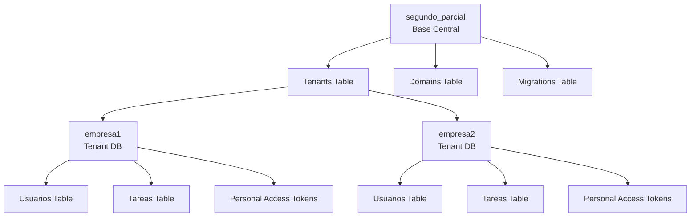
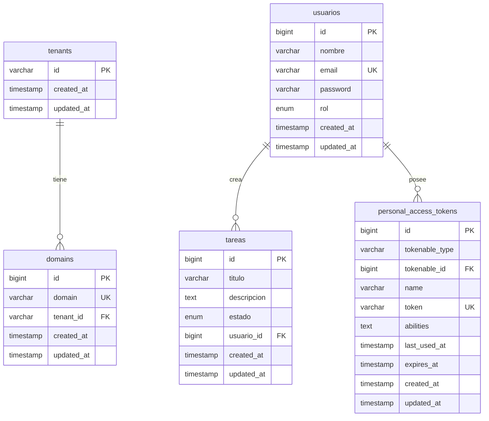

# 🗄️ Esquema de Base de Datos - Sistema Multitenant

Esta documentación detalla la estructura completa de la base de datos del sistema multitenant, incluyendo todas las tablas, relaciones y consideraciones técnicas.

## 🏗️ Arquitectura de Bases de Datos

### 📊 **Estructura Multitenant**
El sistema utiliza un enfoque de **separación por base de datos** para el multitenancy:



### 🔧 **Configuración de Conexiones**
```php
// config/database.php
'connections' => [
    'mysql' => [
        'driver' => 'mysql',
        'host' => env('DB_HOST', '127.0.0.1'),
        'port' => env('DB_PORT', '3306'),
        'database' => env('DB_DATABASE', 'segundo_parcial'),
        'username' => env('DB_USERNAME', 'forge'),
        'password' => env('DB_PASSWORD', ''),
        // ... configuraciones adicionales
    ],
    
    'tenant' => [
        'driver' => 'mysql',
        'host' => env('DB_HOST', '127.0.0.1'),
        'port' => env('DB_PORT', '3306'),
        // database se establece dinámicamente por tenant
        'username' => env('DB_USERNAME', 'forge'),
        'password' => env('DB_PASSWORD', ''),
        // ... configuraciones adicionales
    ],
],
```

---

# 🏢 Base de Datos Central: `segundo_parcial`

La base de datos central contiene información del sistema multitenant y metadatos de tenants.

## 📋 **Tabla: `tenants`**
Almacena información básica de cada tenant (empresa).

### 🏗️ **Estructura**
| Campo | Tipo | Atributos | Descripción |
|-------|------|-----------|-------------|
| `id` | VARCHAR(255) | PRIMARY KEY | Identificador único del tenant |
| `created_at` | TIMESTAMP | NULL | Fecha de creación |
| `updated_at` | TIMESTAMP | NULL | Fecha de última actualización |

### 📝 **SQL de Creación**
```sql
CREATE TABLE `tenants` (
  `id` varchar(255) COLLATE utf8mb4_unicode_ci NOT NULL,
  `created_at` timestamp NULL DEFAULT NULL,
  `updated_at` timestamp NULL DEFAULT NULL,
  PRIMARY KEY (`id`)
) ENGINE=InnoDB DEFAULT CHARSET=utf8mb4 COLLATE=utf8mb4_unicode_ci;
```

### 📊 **Datos de Ejemplo**
```sql
INSERT INTO tenants (id, created_at, updated_at) VALUES
('empresa1', '2024-01-15 10:00:00', '2024-01-15 10:00:00'),
('empresa2', '2024-01-15 10:00:00', '2024-01-15 10:00:00');
```

### 🔍 **Consultas Comunes**
```sql
-- Listar todos los tenants
SELECT * FROM tenants ORDER BY created_at;

-- Verificar si un tenant existe
SELECT COUNT(*) FROM tenants WHERE id = 'empresa1';

-- Obtener tenants creados recientemente
SELECT * FROM tenants WHERE created_at >= DATE_SUB(NOW(), INTERVAL 7 DAY);
```

---

## 🌐 **Tabla: `domains`**
Mapea dominios a tenants específicos para el enrutamiento multitenant.

### 🏗️ **Estructura**
| Campo | Tipo | Atributos | Descripción |
|-------|------|-----------|-------------|
| `id` | BIGINT UNSIGNED | PRIMARY KEY, AUTO_INCREMENT | ID único del registro |
| `domain` | VARCHAR(255) | UNIQUE | Dominio asociado al tenant |
| `tenant_id` | VARCHAR(255) | FOREIGN KEY | Referencia al tenant |
| `created_at` | TIMESTAMP | NULL | Fecha de creación |
| `updated_at` | TIMESTAMP | NULL | Fecha de última actualización |

### 📝 **SQL de Creación**
```sql
CREATE TABLE `domains` (
  `id` bigint unsigned NOT NULL AUTO_INCREMENT,
  `domain` varchar(255) COLLATE utf8mb4_unicode_ci NOT NULL,
  `tenant_id` varchar(255) COLLATE utf8mb4_unicode_ci NOT NULL,
  `created_at` timestamp NULL DEFAULT NULL,
  `updated_at` timestamp NULL DEFAULT NULL,
  PRIMARY KEY (`id`),
  UNIQUE KEY `domains_domain_unique` (`domain`),
  KEY `domains_tenant_id_foreign` (`tenant_id`),
  CONSTRAINT `domains_tenant_id_foreign` 
    FOREIGN KEY (`tenant_id`) REFERENCES `tenants` (`id`) 
    ON DELETE CASCADE ON UPDATE CASCADE
) ENGINE=InnoDB DEFAULT CHARSET=utf8mb4 COLLATE=utf8mb4_unicode_ci;
```

### 📊 **Datos de Ejemplo**
```sql
INSERT INTO domains (domain, tenant_id, created_at, updated_at) VALUES
('empresa1.localhost', 'empresa1', '2024-01-15 10:00:00', '2024-01-15 10:00:00'),
('empresa2.localhost', 'empresa2', '2024-01-15 10:00:00', '2024-01-15 10:00:00'),
('empresa1.midominio.com', 'empresa1', '2024-01-15 10:00:00', '2024-01-15 10:00:00'),
('empresa2.midominio.com', 'empresa2', '2024-01-15 10:00:00', '2024-01-15 10:00:00');
```

### 🔍 **Consultas Comunes**
```sql
-- Buscar tenant por dominio
SELECT t.* FROM tenants t 
INNER JOIN domains d ON t.id = d.tenant_id 
WHERE d.domain = 'empresa1.localhost';

-- Listar todos los dominios de un tenant
SELECT domain FROM domains WHERE tenant_id = 'empresa1';

-- Verificar disponibilidad de dominio
SELECT COUNT(*) FROM domains WHERE domain = 'nuevo.localhost';
```

---

## 📊 **Tabla: `migrations`**
Control de versiones de las migraciones ejecutadas.

### 🏗️ **Estructura**
| Campo | Tipo | Atributos | Descripción |
|-------|------|-----------|-------------|
| `id` | INT UNSIGNED | PRIMARY KEY, AUTO_INCREMENT | ID único |
| `migration` | VARCHAR(255) | | Nombre del archivo de migración |
| `batch` | INT | | Lote de ejecución |

### 📝 **SQL de Creación**
```sql
CREATE TABLE `migrations` (
  `id` int unsigned NOT NULL AUTO_INCREMENT,
  `migration` varchar(255) COLLATE utf8mb4_unicode_ci NOT NULL,
  `batch` int NOT NULL,
  PRIMARY KEY (`id`)
) ENGINE=InnoDB DEFAULT CHARSET=utf8mb4 COLLATE=utf8mb4_unicode_ci;
```

### 📊 **Datos de Ejemplo**
```sql
INSERT INTO migrations (migration, batch) VALUES
('2025_09_19_023919_create_personal_access_tokens_table', 1),
('2025_09_19_025815_create_usuarios_table', 1),
('2025_09_19_025838_create_tareas_table', 1);
```

---

# 🏢 Bases de Datos de Tenants: `empresa1` / `empresa2`

Cada tenant tiene su propia base de datos completamente aislada con la misma estructura.

## 👥 **Tabla: `usuarios`**
Almacena información de usuarios específicos de cada empresa.

### 🏗️ **Estructura**
| Campo | Tipo | Atributos | Descripción |
|-------|------|-----------|-------------|
| `id` | BIGINT UNSIGNED | PRIMARY KEY, AUTO_INCREMENT | ID único del usuario |
| `nombre` | VARCHAR(255) | NOT NULL | Nombre completo del usuario |
| `email` | VARCHAR(255) | UNIQUE, NOT NULL | Email único en el tenant |
| `password` | VARCHAR(255) | NOT NULL | Contraseña hasheada |
| `rol` | ENUM('admin', 'usuario') | DEFAULT 'usuario' | Rol del usuario |
| `created_at` | TIMESTAMP | NULL | Fecha de creación |
| `updated_at` | TIMESTAMP | NULL | Fecha de última actualización |

### 📝 **SQL de Creación**
```sql
CREATE TABLE `usuarios` (
  `id` bigint unsigned NOT NULL AUTO_INCREMENT,
  `nombre` varchar(255) COLLATE utf8mb4_unicode_ci NOT NULL,
  `email` varchar(255) COLLATE utf8mb4_unicode_ci NOT NULL,
  `password` varchar(255) COLLATE utf8mb4_unicode_ci NOT NULL,
  `rol` enum('admin','usuario') COLLATE utf8mb4_unicode_ci NOT NULL DEFAULT 'usuario',
  `created_at` timestamp NULL DEFAULT NULL,
  `updated_at` timestamp NULL DEFAULT NULL,
  PRIMARY KEY (`id`),
  UNIQUE KEY `usuarios_email_unique` (`email`)
) ENGINE=InnoDB DEFAULT CHARSET=utf8mb4 COLLATE=utf8mb4_unicode_ci;
```

### 📊 **Datos de Ejemplo - empresa1**
```sql
INSERT INTO empresa1.usuarios (nombre, email, password, rol, created_at, updated_at) VALUES
('Admin Empresa 1', 'admin@empresa1.com', '$2y$12$...hasheada...', 'admin', '2024-01-15 10:30:00', '2024-01-15 10:30:00'),
('Usuario Empresa 1', 'user@empresa1.com', '$2y$12$...hasheada...', 'usuario', '2024-01-15 11:15:00', '2024-01-15 11:15:00'),
('Manager Empresa 1', 'manager@empresa1.com', '$2y$12$...hasheada...', 'admin', '2024-01-15 12:00:00', '2024-01-15 12:00:00');
```

### 📊 **Datos de Ejemplo - empresa2**
```sql
INSERT INTO empresa2.usuarios (nombre, email, password, rol, created_at, updated_at) VALUES
('Admin Empresa 2', 'admin@empresa2.com', '$2y$12$...hasheada...', 'admin', '2024-01-15 10:30:00', '2024-01-15 10:30:00'),
('Usuario Empresa 2', 'user@empresa2.com', '$2y$12$...hasheada...', 'usuario', '2024-01-15 11:15:00', '2024-01-15 11:15:00'),
('Supervisor Empresa 2', 'supervisor@empresa2.com', '$2y$12$...hasheada...', 'admin', '2024-01-15 12:30:00', '2024-01-15 12:30:00');
```

### 🔍 **Consultas Comunes**
```sql
-- Buscar usuario por email
SELECT * FROM usuarios WHERE email = 'admin@empresa1.com';

-- Listar usuarios por rol
SELECT * FROM usuarios WHERE rol = 'admin' ORDER BY created_at;

-- Contar usuarios por rol
SELECT rol, COUNT(*) as total FROM usuarios GROUP BY rol;

-- Buscar usuarios por patrón de nombre
SELECT * FROM usuarios WHERE nombre LIKE '%Admin%';

-- Usuarios creados en el último mes
SELECT * FROM usuarios WHERE created_at >= DATE_SUB(NOW(), INTERVAL 1 MONTH);
```

---

## ✅ **Tabla: `tareas`**
Gestiona las tareas asignadas a usuarios dentro de cada empresa.

### 🏗️ **Estructura**
| Campo | Tipo | Atributos | Descripción |
|-------|------|-----------|-------------|
| `id` | BIGINT UNSIGNED | PRIMARY KEY, AUTO_INCREMENT | ID único de la tarea |
| `titulo` | VARCHAR(255) | NOT NULL | Título de la tarea |
| `descripcion` | TEXT | NULL | Descripción detallada |
| `estado` | ENUM('pendiente', 'completada') | DEFAULT 'pendiente' | Estado actual |
| `usuario_id` | BIGINT UNSIGNED | FOREIGN KEY | Creador de la tarea |
| `created_at` | TIMESTAMP | NULL | Fecha de creación |
| `updated_at` | TIMESTAMP | NULL | Fecha de última actualización |

### 📝 **SQL de Creación**
```sql
CREATE TABLE `tareas` (
  `id` bigint unsigned NOT NULL AUTO_INCREMENT,
  `titulo` varchar(255) COLLATE utf8mb4_unicode_ci NOT NULL,
  `descripcion` text COLLATE utf8mb4_unicode_ci,
  `estado` enum('pendiente','completada') COLLATE utf8mb4_unicode_ci NOT NULL DEFAULT 'pendiente',
  `usuario_id` bigint unsigned NOT NULL,
  `created_at` timestamp NULL DEFAULT NULL,
  `updated_at` timestamp NULL DEFAULT NULL,
  PRIMARY KEY (`id`),
  KEY `tareas_usuario_id_foreign` (`usuario_id`),
  CONSTRAINT `tareas_usuario_id_foreign` 
    FOREIGN KEY (`usuario_id`) REFERENCES `usuarios` (`id`) 
    ON DELETE CASCADE
) ENGINE=InnoDB DEFAULT CHARSET=utf8mb4 COLLATE=utf8mb4_unicode_ci;
```

### 📊 **Datos de Ejemplo - empresa1**
```sql
INSERT INTO empresa1.tareas (titulo, descripcion, estado, usuario_id, created_at, updated_at) VALUES
('Revisar documentación del proyecto', 'Necesito revisar toda la documentación técnica antes de la reunión', 'pendiente', 1, '2024-01-15 12:00:00', '2024-01-15 12:00:00'),
('Preparar presentación mensual', 'Crear slides para la presentación de resultados del mes', 'completada', 1, '2024-01-15 09:30:00', '2024-01-15 15:45:00'),
('Capacitar nuevo empleado', 'Realizar sesión de onboarding con el nuevo integrante del equipo', 'pendiente', 2, '2024-01-15 14:20:00', '2024-01-15 14:20:00'),
('Actualizar base de datos', 'Ejecutar script de migración en el servidor de producción', 'pendiente', 3, '2024-01-15 16:10:00', '2024-01-15 16:10:00');
```

### 📊 **Datos de Ejemplo - empresa2**
```sql
INSERT INTO empresa2.tareas (titulo, descripcion, estado, usuario_id, created_at, updated_at) VALUES
('Análisis de métricas Q1', 'Generar reporte completo de métricas del primer trimestre', 'completada', 1, '2024-01-15 08:00:00', '2024-01-15 17:30:00'),
('Implementar nueva funcionalidad', 'Desarrollar módulo de reportes avanzados según requerimientos', 'pendiente', 2, '2024-01-15 10:45:00', '2024-01-15 10:45:00'),
('Reunión con cliente principal', 'Coordinar meeting para definir roadmap del próximo sprint', 'pendiente', 3, '2024-01-15 13:15:00', '2024-01-15 13:15:00'),
('Optimización de rendimiento', 'Revisar consultas SQL lentas y optimizar indexes', 'completada', 1, '2024-01-15 11:20:00', '2024-01-15 16:50:00');
```

### 🔍 **Consultas Comunes**
```sql
-- Listar tareas de un usuario específico
SELECT * FROM tareas WHERE usuario_id = 1 ORDER BY created_at DESC;

-- Tareas por estado
SELECT estado, COUNT(*) as total FROM tareas GROUP BY estado;

-- Tareas pendientes con información del usuario
SELECT t.*, u.nombre as usuario_nombre, u.email as usuario_email
FROM tareas t 
INNER JOIN usuarios u ON t.usuario_id = u.id 
WHERE t.estado = 'pendiente'
ORDER BY t.created_at;

-- Buscar tareas por texto
SELECT * FROM tareas 
WHERE titulo LIKE '%documentación%' OR descripcion LIKE '%documentación%';

-- Tareas completadas en la última semana
SELECT t.*, u.nombre as usuario_nombre
FROM tareas t 
INNER JOIN usuarios u ON t.usuario_id = u.id 
WHERE t.estado = 'completada' 
AND t.updated_at >= DATE_SUB(NOW(), INTERVAL 7 DAY);

-- Estadísticas por usuario
SELECT u.nombre, u.email,
       COUNT(t.id) as total_tareas,
       SUM(CASE WHEN t.estado = 'completada' THEN 1 ELSE 0 END) as completadas,
       SUM(CASE WHEN t.estado = 'pendiente' THEN 1 ELSE 0 END) as pendientes
FROM usuarios u 
LEFT JOIN tareas t ON u.id = t.usuario_id 
GROUP BY u.id, u.nombre, u.email
ORDER BY total_tareas DESC;
```

---

## 🔑 **Tabla: `personal_access_tokens`**
Maneja tokens de autenticación Sanctum para cada tenant.

### 🏗️ **Estructura**
| Campo | Tipo | Atributos | Descripción |
|-------|------|-----------|-------------|
| `id` | BIGINT UNSIGNED | PRIMARY KEY, AUTO_INCREMENT | ID único del token |
| `tokenable_type` | VARCHAR(255) | NOT NULL | Tipo de modelo (Usuario) |
| `tokenable_id` | BIGINT UNSIGNED | NOT NULL | ID del usuario |
| `name` | VARCHAR(255) | NOT NULL | Nombre del token |
| `token` | VARCHAR(64) | UNIQUE, NOT NULL | Hash del token |
| `abilities` | TEXT | NULL | Permisos del token |
| `last_used_at` | TIMESTAMP | NULL | Último uso |
| `expires_at` | TIMESTAMP | NULL | Fecha de expiración |
| `created_at` | TIMESTAMP | NULL | Fecha de creación |
| `updated_at` | TIMESTAMP | NULL | Fecha de actualización |

### 📝 **SQL de Creación**
```sql
CREATE TABLE `personal_access_tokens` (
  `id` bigint unsigned NOT NULL AUTO_INCREMENT,
  `tokenable_type` varchar(255) COLLATE utf8mb4_unicode_ci NOT NULL,
  `tokenable_id` bigint unsigned NOT NULL,
  `name` varchar(255) COLLATE utf8mb4_unicode_ci NOT NULL,
  `token` varchar(64) COLLATE utf8mb4_unicode_ci NOT NULL,
  `abilities` text COLLATE utf8mb4_unicode_ci,
  `last_used_at` timestamp NULL DEFAULT NULL,
  `expires_at` timestamp NULL DEFAULT NULL,
  `created_at` timestamp NULL DEFAULT NULL,
  `updated_at` timestamp NULL DEFAULT NULL,
  PRIMARY KEY (`id`),
  UNIQUE KEY `personal_access_tokens_token_unique` (`token`),
  KEY `personal_access_tokens_tokenable_type_tokenable_id_index` (`tokenable_type`,`tokenable_id`)
) ENGINE=InnoDB DEFAULT CHARSET=utf8mb4 COLLATE=utf8mb4_unicode_ci;
```

### 🔍 **Consultas Comunes**
```sql
-- Tokens activos de un usuario
SELECT * FROM personal_access_tokens 
WHERE tokenable_id = 1 
AND tokenable_type = 'App\\Models\\Usuario'
AND (expires_at IS NULL OR expires_at > NOW());

-- Limpiar tokens expirados
DELETE FROM personal_access_tokens 
WHERE expires_at IS NOT NULL AND expires_at < NOW();

-- Estadísticas de uso de tokens
SELECT tokenable_id, COUNT(*) as total_tokens, MAX(last_used_at) as ultimo_uso
FROM personal_access_tokens 
GROUP BY tokenable_id;
```

---

# 🔗 Relaciones y Constraints

## 📊 **Diagrama ER Completo**


## 🔒 **Constraints de Integridad**

### 📋 **Foreign Keys**
```sql
-- Base Central
ALTER TABLE domains 
ADD CONSTRAINT domains_tenant_id_foreign 
FOREIGN KEY (tenant_id) REFERENCES tenants(id) 
ON DELETE CASCADE ON UPDATE CASCADE;

-- Base Tenant
ALTER TABLE tareas 
ADD CONSTRAINT tareas_usuario_id_foreign 
FOREIGN KEY (usuario_id) REFERENCES usuarios(id) 
ON DELETE CASCADE;

-- Note: personal_access_tokens usa índices compuestos para polymorphic relationships
```

### 🔑 **Índices para Rendimiento**
```sql
-- Base Central
CREATE INDEX idx_domains_tenant_lookup ON domains(tenant_id, domain);
CREATE INDEX idx_tenants_created ON tenants(created_at);

-- Base Tenant
CREATE INDEX idx_usuarios_rol ON usuarios(rol);
CREATE INDEX idx_usuarios_email_lookup ON usuarios(email);
CREATE INDEX idx_tareas_estado ON tareas(estado);
CREATE INDEX idx_tareas_usuario_estado ON tareas(usuario_id, estado);
CREATE INDEX idx_tareas_created ON tareas(created_at);
CREATE INDEX idx_tokens_user_lookup ON personal_access_tokens(tokenable_id, tokenable_type);
CREATE INDEX idx_tokens_expiry ON personal_access_tokens(expires_at);
```

---

# 🚀 Scripts de Mantenimiento

## 🧹 **Script de Limpieza de Datos**
```sql
-- cleanup_database.sql
-- Script para limpieza periódica de datos

-- Limpiar tokens expirados en todas las bases tenant
USE empresa1;
DELETE FROM personal_access_tokens 
WHERE expires_at IS NOT NULL AND expires_at < DATE_SUB(NOW(), INTERVAL 1 DAY);

USE empresa2;
DELETE FROM personal_access_tokens 
WHERE expires_at IS NOT NULL AND expires_at < DATE_SUB(NOW(), INTERVAL 1 DAY);

-- Limpiar tokens no usados en más de 30 días
USE empresa1;
DELETE FROM personal_access_tokens 
WHERE last_used_at IS NOT NULL 
AND last_used_at < DATE_SUB(NOW(), INTERVAL 30 DAY);

USE empresa2;
DELETE FROM personal_access_tokens 
WHERE last_used_at IS NOT NULL 
AND last_used_at < DATE_SUB(NOW(), INTERVAL 30 DAY);

-- Estadísticas post-limpieza
SELECT 'empresa1' as tenant, COUNT(*) as tokens_activos FROM empresa1.personal_access_tokens
UNION ALL
SELECT 'empresa2' as tenant, COUNT(*) as tokens_activos FROM empresa2.personal_access_tokens;
```

## 📊 **Script de Estadísticas**
```sql
-- statistics.sql
-- Script para generar estadísticas del sistema

-- Estadísticas generales por tenant
SELECT 
    'empresa1' as tenant,
    (SELECT COUNT(*) FROM empresa1.usuarios) as total_usuarios,
    (SELECT COUNT(*) FROM empresa1.usuarios WHERE rol = 'admin') as admins,
    (SELECT COUNT(*) FROM empresa1.tareas) as total_tareas,
    (SELECT COUNT(*) FROM empresa1.tareas WHERE estado = 'pendiente') as tareas_pendientes,
    (SELECT COUNT(*) FROM empresa1.tareas WHERE estado = 'completada') as tareas_completadas
UNION ALL
SELECT 
    'empresa2' as tenant,
    (SELECT COUNT(*) FROM empresa2.usuarios) as total_usuarios,
    (SELECT COUNT(*) FROM empresa2.usuarios WHERE rol = 'admin') as admins,
    (SELECT COUNT(*) FROM empresa2.tareas) as total_tareas,
    (SELECT COUNT(*) FROM empresa2.tareas WHERE estado = 'pendiente') as tareas_pendientes,
    (SELECT COUNT(*) FROM empresa2.tareas WHERE estado = 'completada') as tareas_completadas;

-- Actividad reciente (últimos 7 días)
SELECT 'empresa1' as tenant, 'usuarios' as tipo, COUNT(*) as creados_ultima_semana
FROM empresa1.usuarios 
WHERE created_at >= DATE_SUB(NOW(), INTERVAL 7 DAY)
UNION ALL
SELECT 'empresa1' as tenant, 'tareas' as tipo, COUNT(*) as creados_ultima_semana
FROM empresa1.tareas 
WHERE created_at >= DATE_SUB(NOW(), INTERVAL 7 DAY)
UNION ALL
SELECT 'empresa2' as tenant, 'usuarios' as tipo, COUNT(*) as creados_ultima_semana
FROM empresa2.usuarios 
WHERE created_at >= DATE_SUB(NOW(), INTERVAL 7 DAY)
UNION ALL
SELECT 'empresa2' as tenant, 'tareas' as tipo, COUNT(*) as creados_ultima_semana
FROM empresa2.tareas 
WHERE created_at >= DATE_SUB(NOW(), INTERVAL 7 DAY);
```

## 🔄 **Script de Backup**
```bash
#!/bin/bash
# backup_multitenant.sh
# Script de backup completo del sistema multitenant

DATE=$(date +%Y%m%d_%H%M%S)
BACKUP_DIR="/backups/multitenant_$DATE"
mkdir -p $BACKUP_DIR

echo "🗄️ === BACKUP SISTEMA MULTITENANT ===" 
echo "📅 Fecha: $(date)"
echo "📁 Directorio: $BACKUP_DIR"

# Backup base central
echo "📊 Haciendo backup de base central..."
mysqldump -h localhost -u root -p segundo_parcial > $BACKUP_DIR/segundo_parcial.sql

# Backup bases de tenants
echo "🏢 Haciendo backup de empresa1..."
mysqldump -h localhost -u root -p empresa1 > $BACKUP_DIR/empresa1.sql

echo "🏢 Haciendo backup de empresa2..."
mysqldump -h localhost -u root -p empresa2 > $BACKUP_DIR/empresa2.sql

# Crear script de restore
cat > $BACKUP_DIR/restore.sh << 'EOF'
#!/bin/bash
echo "🔄 Restaurando backup del sistema multitenant..."

echo "Restaurando base central..."
mysql -h localhost -u root -p -e "DROP DATABASE IF EXISTS segundo_parcial; CREATE DATABASE segundo_parcial;"
mysql -h localhost -u root -p segundo_parcial < segundo_parcial.sql

echo "Restaurando empresa1..."
mysql -h localhost -u root -p -e "DROP DATABASE IF EXISTS empresa1; CREATE DATABASE empresa1;"
mysql -h localhost -u root -p empresa1 < empresa1.sql

echo "Restaurando empresa2..."
mysql -h localhost -u root -p -e "DROP DATABASE IF EXISTS empresa2; CREATE DATABASE empresa2;"
mysql -h localhost -u root -p empresa2 < empresa2.sql

echo "✅ Backup restaurado correctamente"
EOF

chmod +x $BACKUP_DIR/restore.sh

# Comprimir backup
echo "🗜️ Comprimiendo backup..."
tar -czf $BACKUP_DIR.tar.gz -C /backups multitenant_$DATE
rm -rf $BACKUP_DIR

echo "✅ Backup completado: $BACKUP_DIR.tar.gz"
echo "📏 Tamaño: $(du -h $BACKUP_DIR.tar.gz | cut -f1)"
```

---

# ⚡ Optimizaciones de Rendimiento

## 📈 **Índices Recomendados**
```sql
-- Índices para consultas frecuentes en cada tenant

-- Usuarios
CREATE INDEX idx_usuarios_login ON usuarios(email, password);
CREATE INDEX idx_usuarios_role_active ON usuarios(rol, created_at);

-- Tareas
CREATE INDEX idx_tareas_dashboard ON tareas(estado, created_at, usuario_id);
CREATE INDEX idx_tareas_search ON tareas(titulo, descripcion, estado);
CREATE INDEX idx_tareas_user_timeline ON tareas(usuario_id, created_at DESC);

-- Tokens
CREATE INDEX idx_tokens_cleanup ON personal_access_tokens(expires_at, last_used_at);
CREATE INDEX idx_tokens_active ON personal_access_tokens(tokenable_id, tokenable_type, expires_at);
```

## 🔧 **Configuraciones MySQL Recomendadas**
```ini
# my.cnf - Configuraciones para multitenant
[mysqld]
# Buffer pool para múltiples bases de datos
innodb_buffer_pool_size = 1G
innodb_buffer_pool_instances = 4

# Optimizaciones para escrituras frecuentes
innodb_log_file_size = 256M
innodb_log_buffer_size = 32M
innodb_flush_log_at_trx_commit = 1

# Configuración de conexiones
max_connections = 500
thread_cache_size = 16

# Optimizaciones de query cache
query_cache_type = 1
query_cache_size = 128M
query_cache_limit = 2M

# Configuraciones de timeout
wait_timeout = 600
interactive_timeout = 600
```

---

# 🔒 Consideraciones de Seguridad

## 🛡️ **Aislamiento de Datos**
- **Separación física**: Cada tenant tiene su propia base de datos
- **Conexiones independientes**: Laravel gestiona conexiones por tenant
- **Validación de acceso**: Verificación de tenant en cada request

## 🔑 **Gestión de Credenciales**
```sql
-- Crear usuarios específicos por tenant (recomendado para producción)
CREATE USER 'tenant_empresa1'@'localhost' IDENTIFIED BY 'password_seguro_empresa1';
GRANT ALL PRIVILEGES ON empresa1.* TO 'tenant_empresa1'@'localhost';

CREATE USER 'tenant_empresa2'@'localhost' IDENTIFIED BY 'password_seguro_empresa2';
GRANT ALL PRIVILEGES ON empresa2.* TO 'tenant_empresa2'@'localhost';

-- Usuario para base central
CREATE USER 'central_admin'@'localhost' IDENTIFIED BY 'password_central_admin';
GRANT ALL PRIVILEGES ON segundo_parcial.* TO 'central_admin'@'localhost';
```

## 🔐 **Cifrado de Datos Sensibles**
```sql
-- Ejemplo de funciones para cifrar datos sensibles
DELIMITER $$
CREATE FUNCTION encrypt_sensitive_data(data VARCHAR(255)) 
RETURNS VARCHAR(255) READS SQL DATA DETERMINISTIC
BEGIN
    RETURN AES_ENCRYPT(data, SHA2('encryption_key_here', 256));
END$$

CREATE FUNCTION decrypt_sensitive_data(encrypted_data VARCHAR(255)) 
RETURNS VARCHAR(255) READS SQL DATA DETERMINISTIC
BEGIN
    RETURN AES_DECRYPT(encrypted_data, SHA2('encryption_key_here', 256));
END$$
DELIMITER ;
```

---

# 📚 Referencias y Documentación

## 🔗 **Enlaces Relacionados**
- [Guía de Instalación Local](../installation/local-setup.md)
- [Endpoints de API](../api/endpoints.md)
- [Componentes del Frontend](../frontend/components.md)
- [Manual de Testing](../testing/manual-testing.md)

## 📖 **Documentación Externa**
- [Laravel Migrations](https://laravel.com/docs/10.x/migrations)
- [MySQL 8.0 Reference](https://dev.mysql.com/doc/refman/8.0/en/)
- [Stancl/Tenancy Database Isolation](https://tenancyforlaravel.com/docs/v3/database-isolation)

## 🆘 **Troubleshooting de Base de Datos**

### 🐛 **Problemas Comunes**

**Error: "Table doesn't exist"**
```sql
-- Verificar que estás en la base correcta
SELECT DATABASE();

-- Listar tablas disponibles
SHOW TABLES;

-- Verificar estructura de tabla
DESCRIBE nombre_tabla;
```

**Error: "Access denied for user"**
```sql
-- Verificar permisos del usuario
SHOW GRANTS FOR 'usuario'@'localhost';

-- Verificar usuarios existentes
SELECT User, Host FROM mysql.user;
```

**Error: "Duplicate entry"**
```sql
-- Verificar constraints únicos
SHOW CREATE TABLE nombre_tabla;

-- Buscar duplicados existentes
SELECT email, COUNT(*) as duplicados 
FROM usuarios 
GROUP BY email 
HAVING COUNT(*) > 1;
```

---

✅ **¡Documentación de Base de Datos Completa!**  
Toda la estructura, relaciones y scripts de mantenimiento están documentados y listos para uso.